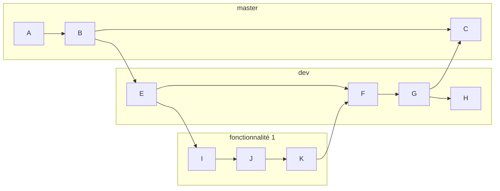

# Let's Eat - Gitflow

## Introduction

Ce document a pour objectif de définir des règles claires concernant l'utilisation de <u>Github</u> dans le cadre du projet LEt's Eat.

L'Ets Eat est un projet permettant de commander des repas préparés en fonction de ses goûts, allergies et à toute forme de régime alimentaires. 

## Les Branches

Cette section concerne les conventions entourant le nommage des branches, la politique de pull request ainsi que celle concernant les issues.

### L'Organisation

L'organisation des différentes branches suit le modèle suivant.

Une version de production démontrable se trouve sur la branche **master**.

En conséquence, la branche **dev** sert de tampon entre les branches servant au développement de nouvelles fonctionnalités (cf. [convention de nommage](Nommage) ci-dessous).

> Les documentations

### Nommage

Les branches servant au développement de fonctionnalités doivent respecter le modèle suivant.

> <grande partie concernée>/<fonctionnalité>

<u>exemples :</u> 

`front/login`

`devops/init`

**N.B. :** Il est possible de rajouter des sous-catégories en suffixe (ex: front/page/login)

### Les Pull Requests (PR)

Toute fonctionnalité développée doit faire l'objet d'une PR en vue de son intégration au sein de la branche **dev**.

L'auteur de la PR est tenu d'assigner en reviewer toute personne impactée d'une quelconque manière par celle-ci ainsi que le chef de projet.

L'auteur de la PR est tenu de merge sa PR en effectuant un "squash" (*squash and merge* sur github) puis de supprimer la branche correspondante (exception faite de la branche **dev**).

> Attention : Toute PR non-validée et sans remarque depuis une durée d'au moins 72h sera considérée comme acceptée.

> Attention : Aucun merge de dev vers master ne doit être effectué sans l'aval du chef de projet.

### Les Issues

En cas de bug avéré, vous pouvez ouvrir une issue Github et assigner la personne qui a ajoutée la fonctionnalité précédemment. En cas de doute sur la personne à assigner, n'hésitez pas à vous renseigner.

Remplissez ensuite un message qui décrit le bug que vous avez identifié. Soyez aussi précis que possible.

> Attention : Surveillez les issues que vous ouvrez, vous risquez d'être recontacté par la personne que vous aurez assigné.

> Attention : Toute issue laissée sans réponse (non acceptée) plus de 48h doit être remontée au chef de projet. 

> Attention : Une issue sans réponse de la part de son créateur depuis plus de 72h sera considéré comme abandonnée et classée sans suite

## Les Commits

Tout commit est constitué d'au moins une ligne répondant à la forme. Il est rédigé en anglais.
Un commit prend la forme :

> [<Action>]  <Description>

<u>exemples:</u>

`[ADD] Login page`

`[UPDATE] Config traefik`

> Attention : Tâchez de limiter la longueur de vos commits. Dans cette optique, pensez à commit régulièrement. La longueur maximale d'un commit est laissé à la discrétion des différents participants aux projets.